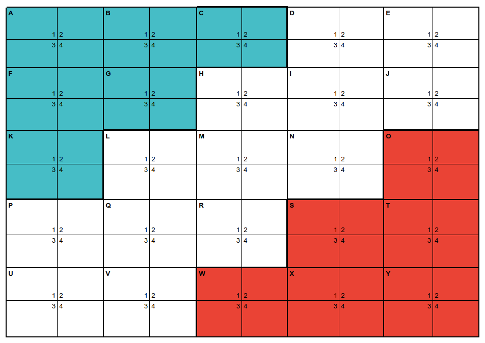

# QuadrantZ
A command line client for the game Quadrant Z.

Rules and Gameplay adapted from this archive [link](http://web.archive.org/web/20070419232114/http://www.boardgames.za.net/gamesbook/mygames/quad-z.htm), by Derek Hohls 1999.

[This](https://docs.google.com/spreadsheets/d/1RIuAiVVTHDf63rVZyJDMhRWgIkl3lfeoc5x6ANbSi6w/edit?usp=sharing){:target="_blank" rel="noopener"} is the initial setup for the game board:

{:target="_blank" rel="noopener"}
